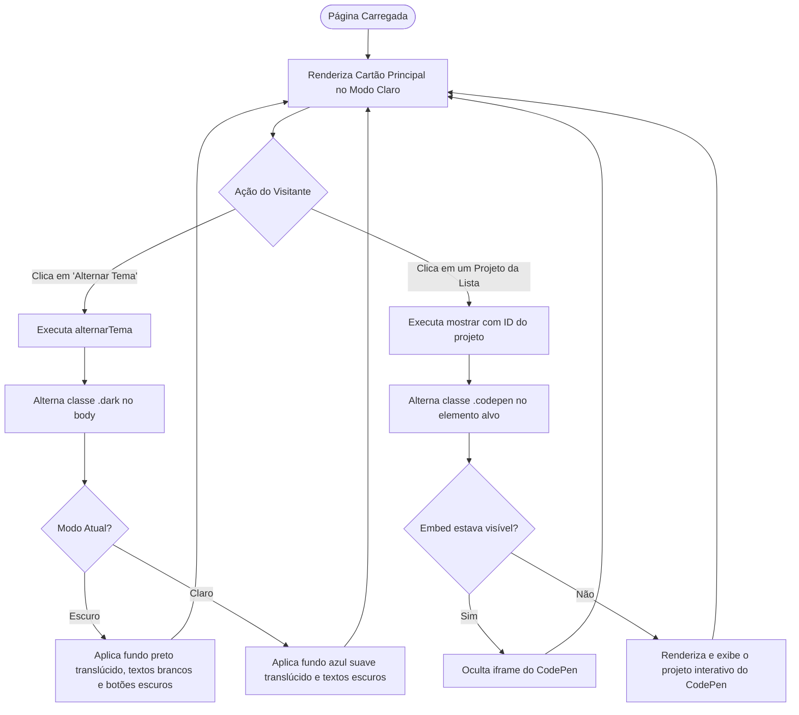

# 🎨 Portfólio Web Interativo — Alura Imersão Dev

<br />

<div align="center">
  
</div>

<br />

<div align="center">

[](https://portfolio-woad-three-68.vercel.app/)
[](https://developer.mozilla.org/pt-BR/docs/Web/HTML)
[](https://developer.mozilla.org/pt-BR/docs/Web/CSS)
[](https://developer.mozilla.org/pt-BR/docs/Web/JavaScript)
[](https://codepen.io/erickystn)
[](https://www.alura.com.br/)
[](LICENSE)
[](#)

</div>

---

## 🔗 Demonstração ao Vivo (Deploy)

A aplicação está hospedada e em execução contínua na **Vercel**:

👉 **[Acesse o Portfólio Online](https://portfolio-woad-three-68.vercel.app/)**

---

## 📖 Visão Geral

O **Portfólio Web Interativo** é uma página pessoal desenvolvida como projeto de encerramento da **Imersão Dev da [Alura](https://www.alura.com.br/)**. A plataforma foi concebida para reunir e exibir de forma dinâmica e elegante os desafios práticos desenvolvidos ao longo da jornada de capacitação em lógica de programação e tecnologias fundamentais da web (**HTML5, CSS3 e JavaScript Vanilla**).

A página conta com um alternador de tema em tempo real (**Light Mode / Dark Mode**), integração com a API de perfil do GitHub para foto de exibição em alta resolução e um sistema de **acordeão interativo sob demanda**, que embute os mini-aplicativos hospedados no **CodePen** apenas quando solicitados pelo usuário, otimizando o carregamento inicial e a performance de renderização.

---

## ✨ Funcionalidades

* **Apresentação de Perfil Integrada:** Cabeçalho com foto de perfil sincronizada via GitHub Avatar (`erickystn.png`), efeito de sombra difusa com brilho suave e tipografia destacada.
* **Alternância de Tema Dinâmica (Light / Dark Mode):** Botão interativo que altera a paleta de cores global da página entre modo claro e modo escuro, adaptando o fundo do card, contrastes tipográficos e o esquema de cores dos botões de ação.
* **Vitrine de Projetos com Acordeão Interativo:** Lista retrátil de projetos onde o clique no título expande ou oculta o container do CodePen, disparando a visualização interativa do código e resultado ao vivo:
  1. 🔢 **Conversor:** Desafio de conversão de unidades e moedas.
  2. 🔮 **Mentalista:** Jogo interativo de adivinhação de números aleatórios.
  3. 🏆 **Tabela de Classificação:** Sistema de pontuação para jogos com vitórias, empates, derrotas e cálculo dinâmico de saldo.
  4. 🃏 **Super Trunfo:** Jogo de cartas baseado no clássico Super Trunfo com comparação de atributos numéricos.
  5. ✌️ **Certificard:** Cartão de identificação profissional digital e portfólio compacto.
* **Zero Dependências de Runtime:** Implementação nativa sem frameworks, garantindo resposta instantânea aos cliques e baixo consumo de recursos no navegador.

---

## 🎯 Diferenciais e Destaques Técnicos

1. **Manipulação Leve do DOM com `classList.toggle()`:** A lógica interativa do script é concisa e declarativa, utilizando o método nativo `classList.toggle` para controle de visibilidade dos embeds (`.codepen`) e para alternar a classe `.dark` no elemento `document.body`.
2. **Carregamento Otimizado de Scripts Externos:** Os embeds do CodePen utilizam o atributo `async` na inclusão do script `ei.js`, prevenindo bloqueios na renderização inicial da página (*render-blocking resources*).
3. **Estilização com Gradientes Lineares Complexos:** O contêiner de projetos utiliza gradientes angulares de 90 graus combinando tons de cinza translúcido, azul profundo e magenta suave (`rgba(255, 0, 228, 0.38)`).
4. **Efeito Visual de Cartão Translúcido:** O contêiner central emprega fundos com canal alfa (`rgba(236, 244, 255, 0.7)` no modo claro e `rgba(0, 0, 0, 0.88)` no modo escuro) associados a sombras de caixa profundas (`box-shadow`), proporcionando estética similar ao Glassmorphism.
5. **Tipografia Moderna:** Integração com a Google Font **Roboto** (pesos 400 Regular e 700 Bold), com sombras projetadas nos títulos (*text-shadow*) para assegurar legibilidade em qualquer fundo.

---

## 🏗️ Arquitetura e Estrutura de Pastas

```bash
portfolio/
├── README.md                                  # Documentação técnica e guia do projeto
├── index.html                                 # Estrutura semântica e ancoragem dos embeds CodePen
├── script.js                                  # Lógica JavaScript para alternância de tema e exibição
└── style.css                                  # Estilos CSS, gradientes, temas claro/escuro e sombras
```

---

## 📦 Vitrine de Projetos Integrados

Abaixo está o detalhamento dos 5 projetos da Imersão Dev embutidos no portfólio:

| Ícone | Projeto | Slug CodePen | Conceitos Praticados | Link Oficial |
| :---: | :--- | :--- | :--- | :---: |
| 🔢 | **Conversor** | `gOoONwg` | Operações aritméticas, I/O interativo e interpolação de strings. | [Ver no CodePen](https://codepen.io/erickystn/pen/gOoONwg) |
| 🔮 | **Mentalista** | `gOoYZXE` | Geração de números randômicos com `Math.random()`, estruturas condicionais e laços. | [Ver no CodePen](https://codepen.io/erickystn/pen/gOoYZXE) |
| 🏆 | **Tabela de Classificação** | `QWawgEO` | Manipulação de arrays de objetos, tabelas HTML dinâmicas e cálculo de pontos. | [Ver no CodePen](https://codepen.io/erickystn/pen/QWawgEO) |
| 🃏 | **Super Trunfo** | `dyJGVyN` | Comparação de atributos de cartas, renderização condicional e manipulação de estado. | [Ver no CodePen](https://codepen.io/erickystn/pen/dyJGVyN) |
| ✌️ | **Certificard** | `LYeGQOy` | Cartão de identificação profissional, estilização moderna e links sociais. | [Ver no CodePen](https://codepen.io/erickystn/pen/LYeGQOy) |

---

## 🔄 Fluxo de Interatividade da Interface



---

## 📸 Telas da Aplicação (Demonstração)

<details open>
<summary><b>☀️ Modo Claro (Light Mode)</b></summary>

<br />

<div align="center">
  
</div>

</details>

<br />

<details>
<summary><b>🌙 Modo Escuro (Dark Mode)</b></summary>

<br />

<div align="center">
  
</div>

</details>

---

## 📖 Passo a Passo de Uso

1. **Acessar a Página:** Abra o [Deploy oficial na Vercel](https://portfolio-woad-three-68.vercel.app/) ou execute localmente no navegador.
2. **Alternar Cores:** Clique no botão superior direito **"Alternar Tema"** para experimentar o contraste entre o tema claro padrão e o tema escuro.
3. **Explorar os Projetos:**
   * Clique sobre o nome de qualquer projeto (ex: *🔢 Conversor* ou *🃏 Super Trunfo*).
   * O card do projeto se expandirá revelando o código-fonte e a tela interativa do CodePen pronta para execução e teste direto na página.
   * Clique novamente para recolher o projeto.

---

## 🎓 Objetivo do Projeto

Este projeto representa o marco de conclusão da **Imersão Dev da Alura**, consolidando na prática:
* Conexão entre HTML, CSS e JavaScript sem abstrações de bibliotecas ou frameworks.
* Uso de JavaScript para interatividade orientada a eventos (`onclick`, `toggle`).
* Integração de serviços de terceiros para desenvolvedores (CodePen Embed API e GitHub CDN).
* Implantação e entrega contínua com Vercel.

---

## ⚙️ Requisitos e Instalação

### Pré-requisitos
* Qualquer navegador web moderno com suporte a JavaScript habilitado (Google Chrome, Firefox, Edge, Safari).
* [Git](https://git-scm.com/) para clonagem do repositório.

### Instalação

1. Clone o repositório em sua máquina:
```bash
git clone https://github.com/erickystn/portfolio.git
```

2. Entre no diretório do projeto:
```bash
cd portfolio
```

---

## 🚀 Como Executar

Por ser uma aplicação web estática baseada exclusivamente em HTML, CSS e JavaScript nativos, nenhum gerenciador de pacotes ou compilador é necessário:

### Opção 1: Execução Direta
Abra o arquivo `index.html` diretamente em seu navegador preferido através de um duplo clique.

### Opção 2: Servidor Local Leve (Live Server / Python / Node)

* **Via Extensão Live Server do VS Code:**
  Abra a pasta do projeto no VS Code, clique com o botão direito sobre `index.html` e selecione *"Open with Live Server"*.

* **Via Python:**
  ```bash
  python3 -m http.server 3000
  ```
  Acesse no navegador: `http://localhost:3000`

* **Via Node.js (`npx serve`):**
  ```bash
  npx serve .
  ```

---

## 💻 Exemplos de Código

### 1. Funções de Interatividade e Tema (`script.js`)
```javascript
function mostrar(valor) {
  document.getElementById(valor).classList.toggle("codepen");
}

function alternarTema() {
  document.body.classList.toggle("dark");
}
```

---

### 2. Estilização do Dark Mode no CSS (`style.css`)
```css
.dark .principal {
  background: rgba(0, 0, 0, 0.88);
}

.dark .titulo {
  color: white;
}

.dark .tema button {
  box-shadow: 3px 4px 0px 0px #e8e8e8;
  background: linear-gradient(to bottom, #000000 5%, #706c70 100%);
  background-color: #000000;
  border-radius: 15px;
  border: 1px solid #ffffff;
  color: #ffffff;
}

.dark .tema button:hover {
  background: linear-gradient(to bottom, #706c70 5%, #000000 100%);
  background-color: #706c70;
}
```

---

## 🧪 Suíte de Testes e Validação

O projeto foi validado por meio de checagens manuais e testes de compatibilidade:
1. **Alternância de Tema:** Verificação da persistência e contraste das fontes nos modos claro e escuro.
2. **Carregamento de Iframes do CodePen:** Teste de expansão e colapso de cada um dos 5 projetos embutidos.
3. **Compatibilidade Cross-Browser:** Homologado em navegadores modernos desktop e mobile.

---

## 🛠️ Tecnologias Utilizadas

| Tecnologia | Função no Projeto |
| :--- | :--- |
| **[HTML5](https://developer.mozilla.org/pt-BR/docs/Web/HTML)** | Estruturação semântica, seções de perfil e marcação dos contêineres de projetos. |
| **[CSS3](https://developer.mozilla.org/pt-BR/docs/Web/CSS)** | Estilos visuais, gradientes lineares, sombras profundas e regras de Dark Mode. |
| **[JavaScript Vanilla](https://developer.mozilla.org/pt-BR/docs/Web/JavaScript)** | Manipulação do DOM para alternância de tema e toggle de visibilidade dos projetos. |
| **[CodePen Embed API](https://blog.codepen.io/documentation/embedded-pens/)** | Script externo (`ei.js`) responsável pela renderização interativa dos projetos. |
| **[Google Fonts](https://fonts.google.com/specimen/Roboto)** | Tipografia primária Roboto aplicada globalmente. |
| **[Vercel](https://vercel.com/)** | Plataforma de hospedagem estática e deploy contínuo da aplicação. |

---

## 📈 Melhorias e Próximos Passos (Roadmap)

- [ ] **Persistência de Tema no LocalStorage:** Salvar a escolha de tema do usuário (Light/Dark) para restaurá-la automaticamente na próxima visita.
- [ ] **Transição Suave de Cores:** Adicionar `transition: background 0.3s ease, color 0.3s ease` no CSS para suavizar a transição entre temas.
- [ ] **Design Responsivo para Mobile:** Adicionar media queries personalizadas para ajustar o espaçamento do card em smartphones compactos.
- [ ] **Seção de Habilidades e Contato:** Incluir ícones de tecnologias dominadas e links para LinkedIn e e-mail.
- [ ] **Acessibilidade Aprimorada:** Adicionar atributos `aria-expanded` e tags semânticas `<button>` nos itens da lista para suporte a leitores de tela.

---

## 🤝 Como Contribuir

1. Faça um **Fork** do projeto.
2. Crie uma branch com sua funcionalidade:
   ```bash
   git checkout -b feature/minha-melhoria
   ```
3. Commit suas alterações:
   ```bash
   git commit -m "feat: adiciona persistencia de tema no localStorage"
   ```
4. Envie as modificações para o seu fork:
   ```bash
   git push origin feature/minha-melhoria
   ```
5. Abra um **Pull Request** explicando as mudanças implementadas.

---

## 👤 Autor & Créditos

* **Desenvolvedor:** [Ericky Santana](https://github.com/erickystn)
* **Perfil no CodePen:** [@erickystn](https://codepen.io/erickystn)
* **Formação:** Projeto concebido durante a **Imersão Dev** da [Alura](https://www.alura.com.br/).

---

## 📄 Licença

Este projeto está licenciado sob a licença **MIT**. Para maiores informações, consulte o arquivo de licença ou sinta-se à vontade para clonar, estudar e customizar o portfólio.
